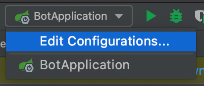

# Инструкция по запуску

Ссылка на основную сущность ```Update``` https://core.telegram.org/bots/api#update

Каждый раз, когда приходит сообщение боту, то в
```ru.paraktikumbot.bot.main.common.controller.MainController```
приходит событие с этой сущностью, в дальнейшем ее нужно расширять

1) Получите token от BotFather на своего бота и проставьте в 
   bot.token в /src/main/resources/application.properties
2) Установите ngrok c этого сайта https://ngrok.com/download (нужен для тоннелей на локальную машину)
3) Делаем команду в терминале
   
   ```ngrok http 8080```
   
У нас появляется тоннель 
> 

4) Копируем ссылку из Forwarding, которая начинается с https БЕЗ СТРЕЛОЧКИ
5) Вставляем ссылку в /src/main/resources в переменную webhook.url

Должно получится так в итоге, но с вашими данными


## Запускаем бота через Maven

```export BOT_TOKEN=<ваш токен>```

```echo ${BOT_TOKEN}``` - проверка, что есть такая переменная 

```./mvnw install```

```java -jar ./target/bot-0.0.1-SNAPSHOT.jar```

Для запуска через IDE нужно в настройках запуска проставить переменные окружения  




В консоли помимо всякой всячины должны увидеть это


Означает, что мы почистили вебхук и установили его снова

Вуаля, можно писать боту и получать сообщения, пока что я настроил модель  

```java
public class Update {

    @JsonProperty(value = "update_id")
    private Integer updateId;

    public Integer getUpdateId() {
        return updateId;
    }

    public Update setUpdateId(Integer updateId) {
        this.updateId = updateId;
        return this;
    }
}
```

Она содержит только ```update_id```, далее эту модель нужно расширять для получения остальных данных

Когда ты будешь писать боту, то у тебя в консоли должны выводиться ```update_id``` вот так


# Задание 1

Расширить сущность ```Update``` так, чтобы вы могли видеть в консоли сообщения, которые пишите боту

# Задание 2

Я добавил вот такую штукецию

Это конфигурационный класс в котором определено правило создание Бина ```@Bean```

Данный бин создается в общем контексте, и теперь вы сможете его использовать в любом месте вашего приложения

```java
@Configuration
public class RestTemplateConfig {

    @Bean
    public RestTemplate restTemplate() {
        return new RestTemplate();
    }
}
```  

По факту это просто объект, ответственность за создание которого мы возлагаем на Spring, а с помощью встроенного механизма инъекции зависимостей мы инжектим его через конструктор в нужном месте

Пример использования можно найти вот тут ```ru.paraktikumbot.bot.main.common.config.BotConfig```
Spring видит, что есть вот такой вот бин и во время запуска производит создание бина и инжектит его через конструктор уже к нам в класс

### Задача: 

0) Закоммитить и запушить в мастер то, что у вас уже есть, если оно корректно работает, сделать фича ветку из master (будем как настоящие программисты делать), название любое
1) Создать класс с постфиксом Service (название придумать самим - это самое сложное), который будет отвечать за запросы к API телеграм
2) Создать метод в этом классе, который будет реализовывать отправку сообщения в чат с пользователем
3) Сделать так, чтобы на любое сообщение бот отвечал - "Hello, i am bot", пример создания запроса есть тоже в ```BotConfig```

Ваш класс необходимо будет пометить специальной аннотацией @Service, чтобы автоматически создался бин (точно также как проставлена аннотация @Configuration)

Далее произвести инжект вашего класса через конструктор в ```MainController``` как в примере ```BotConfig``` 

> Описание метода sendMessage   
https://core.telegram.org/bots/api#sendmessage

