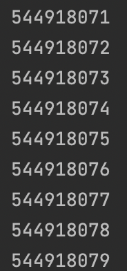

# Инструкция по запуску

Ссылка на основную сущность ```Update``` https://core.telegram.org/bots/api#update

Каждый раз, когда приходит сообщение боту, то в
```ru.paraktikumbot.bot.main.controller.MainController```
приходит событие с этой сущностью, в дальнейшем ее нужно расширять

1) Получите token от BotFather на своего бота и проставьте в 
   bot.token в /src/main/resources/application.properties
2) Установите ngrok c этого сайта https://ngrok.com/download (нужен для тоннелей на локальную машину)
3) Делаем команду в терминале
   
   ```ngrok http 8080```
   
У нас появляется тоннель 
> 

4) Копируем ссылку из Forwarding, которая начинается с https БЕЗ СТРЕЛОЧКИ
5) Вставляем ссылку в /src/main/resources в переменную webhook.url

Должно получится так в итоге, но с вашими данными


## Запускаем бота через Maven

```./mvnw install```

```java -jar ./target/bot-0.0.1-SNAPSHOT.jar```

В консоли помимо всякой всячины должны увидеть это


Означает, что мы почистили вебхук и установили его снова

Вуаля, можно писать боту и получать сообщения, пока что я настроил модель  

```
public class Update {

    @JsonProperty(value = "update_id")
    private Integer updateId;

    public Integer getUpdateId() {
        return updateId;
    }

    public Update setUpdateId(Integer updateId) {
        this.updateId = updateId;
        return this;
    }
}
```

Она содержит только ```update_id```, далее эту модель нужно расширять для получения остальных данных

Когда ты будешь писать боту, то у тебя в консоли должны выводиться ```update_id``` вот так



# Задание

Расширить сущность ```Update``` так, чтобы вы могли видеть в консоли сообщения, которые пишите боту